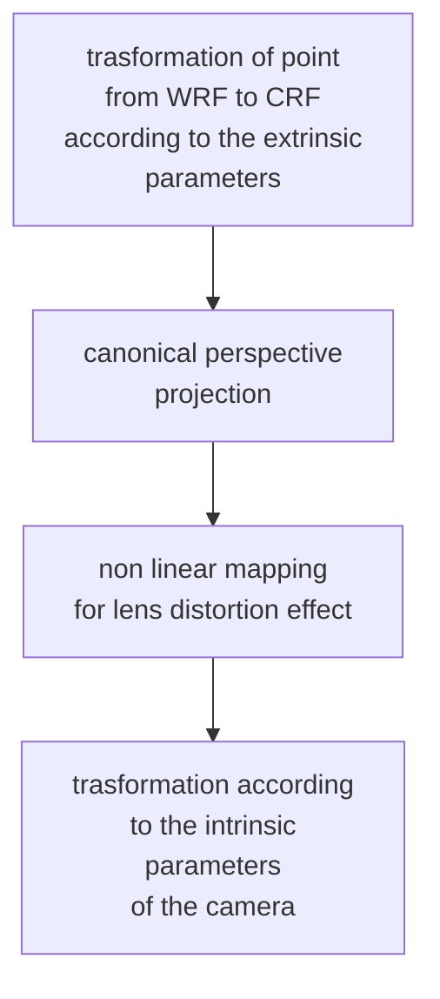

# Image formation flow

```mermaid
flowchart TD
A["`trasformation of point
from WRF to CRF
according to the extrinsic
parameters`"]
B["`canonical perspective
projection`"]
C["`non linear mapping
for lens distortion effect `"]
D["`trasformation according
to the intrinsic
parameters
of the camera`"]
A --> B
B --> C
C --> D
```

[>](pages/computer_vision/image_formation_acquisition/perspective_projection.md)
