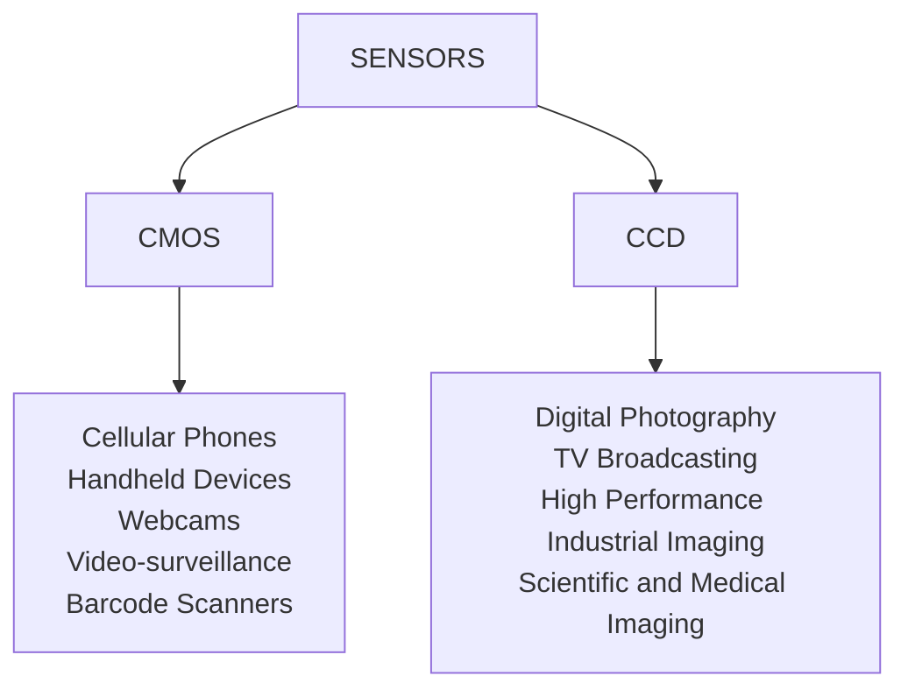

# Sensors

there are 2 main technologies for camera sensors, **CCD** and **CMOS**

In short **CMOS** is for low quality mass production and **CCD** is for high end quality image processing.
[<](pages/computer_vision/image_formation_acquisition/image_digitization.md)[>](pages/computer_vision/image_formation_acquisition/lens.md)
