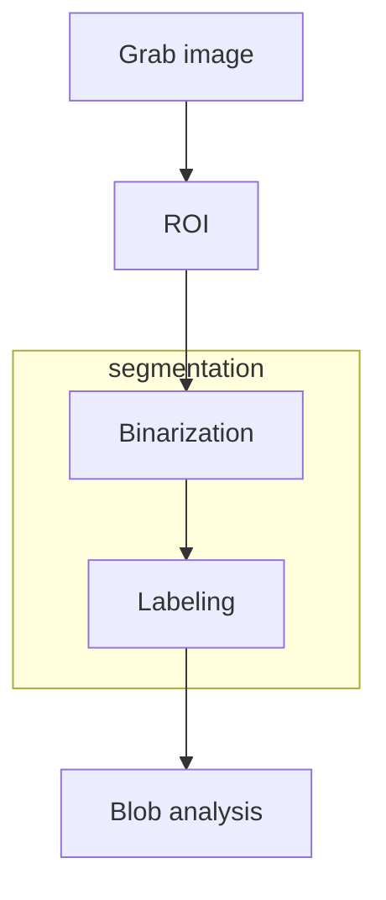

# Computer vision industrial workflow

Computer vision processes in industrial environment follow this schema

[PREVIOUS](pages/computer_vision/image_filtering/non-local_mean_filter.md) [NEXT](pages/computer_vision/image_segmentation_blob_analysis/binarization.md)
