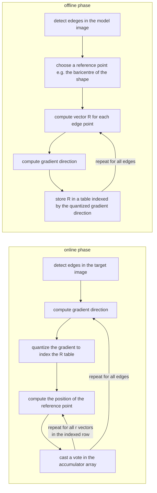

# Generalized hough transform

The Generalized Hough transform (**GHT**) is a generalization aimed to apply **[GHT](pages/computer_vision/object_detection/hough_transform.md)** to non analytical shapes.

## Ght with local invariant features

The most popular computer vision pipeline relies on combining GHT with local invariant features such as the [sift descriptor](pages/computer_vision/local_features/sift_descriptor.md). In this pipeline Local invariant features are used instead of edges.

### Ght: offline phase

Detect keypoints (e.g. [DOG](pages/computer_vision/local_features/dog_detector.md)) and compute descriptors (e.g. [SIFT](pages/computer_vision/local_features/sift_descriptor.md)) in the model image:

$$
F = \{F_1,F_2,...,F_n\}
$$
$$
F_i = (P_i,D_i,\phi_i,S_i)
$$

Choose a reference point (eg the [barycentre](pages/computer_vision/image_segmentation_blob_analysis/blob_analysis.md#barycentre))

$$
P_C = \frac{1}{N}\sum_{i=1}^{N}P_i
$$
Compute the joining vectors between the features and the reference point:

$$
\forall F_i \in F \rightarrow V_i= P_C -P_i
$$

The Star Model consist of the features and their joining vectors (*no need of the R Table*):

$$
F_i = (P_i,D_i,\phi_i,S_i,V_i)
$$

### Ght: online phase

Detect [keypoints](pages/computer_vision/local_features/finding_correspondences.md#keypoints) on the target image and compute descriptors :

$$
\overset{\sim}F = \{\overset{\sim}F_1,\overset{\sim}F_2,...,\overset{\sim}F_n\}
$$
$$
\overset{\sim}F_i = (\overset{\sim}P_i,\overset{\sim}D_i,\overset{\sim}\phi_i,\overset{\sim}S_i)
$$

Match descriptor between target and model image

$$
\forall \overset{\sim}F_i \in \overset{\sim}F \rightarrow \overset{\sim}D_j = D_j
$$

for each keypoint on the target image that matches his descriptor with a keypoint in the model image compute the reference point and cast a vote in the accumulator array

$$
\overset{\sim}P_{C_j} = \overset{\sim}P_j + \overset{\sim}V_j
$$
$$
A[\overset{\sim}P_{C_j} ] ++
$$

## 2D accumulator array issues

A 2D accumulator array is not sufficient to account for rotation and scale, the solution is to use a 4D accumulator array in order to account for scale and rotation

[<](pages/computer_vision/object_detection/hough_transform.md) [>](pages/computer_vision/object_detection/object_detection_pipeline.md)
