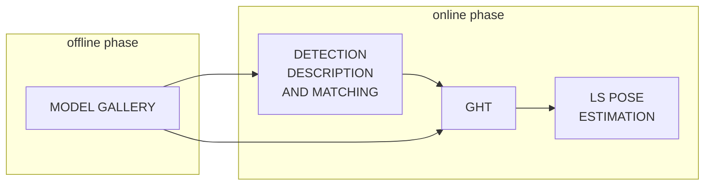

# Object detection pipeline

```mermaid
flowchart LR

subgraph online phase
direction LR
B[DETECTION\n DESCRIPTION\n AND MATCHING]
C[GHT]
D[LS POSE\n ESTIMATION]
B --> C --> D
end

subgraph offline phase
direction RL
A[MODEL GALLERY]
A --> B & C
end
```
[<](pages/computer_vision/object_detection/generalized_hugh_transform.md)[>](pages/computer_vision/machine_learning_cv/machine_learning_in_computer_vision.md)
