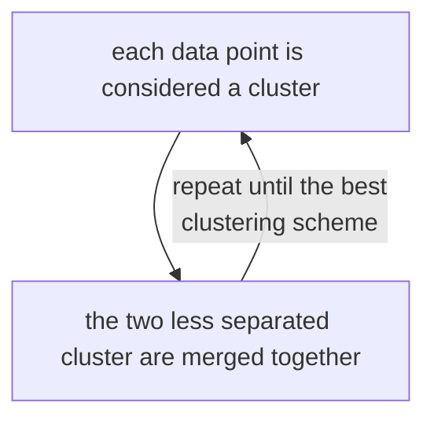
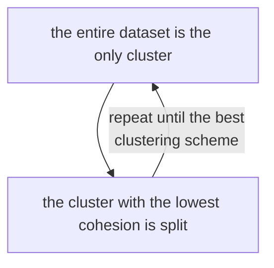

# Hierarchical clustering

Type of clustering that revolves around creating a nested structure of clustering, there are 2 types of hierarchical clustering:

- ## Agglomerative (bottom up approach)

- ## Divisive (top down approach)

## Complexity

the complexity of hierarchical clustering is $\mathcal{O}(N^2)$ for the computation and storage of the distance matrix

for the single step iteration the complexity is $\mathcal{O}((N-1)^2)$

so in conclusion the time complexity is $\mathcal{O}(N^3)$

## Cons

 - poor scaling due to high complexity
 - no global objective function

[PREVIOUS](k-means.md) [NEXT](datamining/model_based_clustering.md)
