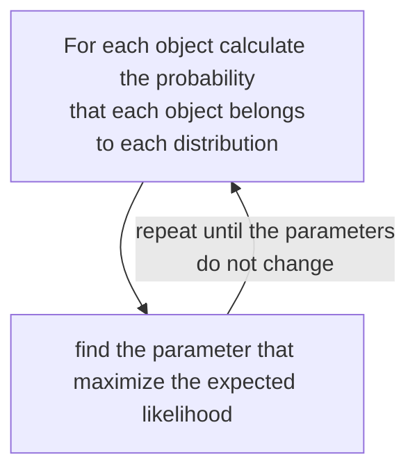

# Model based clustering

The objective is to estimate the parameter of a statistical model

## Expectation maximization

[PREVIOUS](hierarchical_clustering.md) [NEXT](datamining/density_based_clustering.md)
