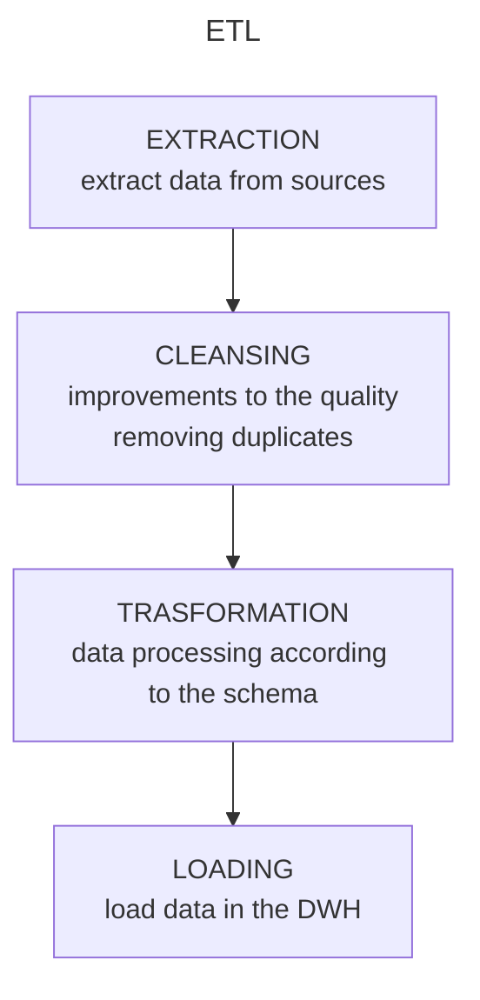
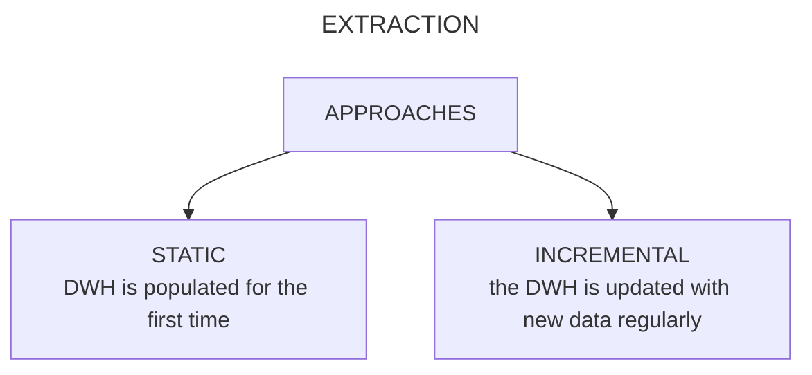

-  Online analitical processing allow users to interactively navigate on the DWH

- navigation is done trough chains of operators

## Olap operators

### roll-up

- adds aggregation to the data collection

	- 

### drill-down

- removes aggregation from the data collection

 

### slice-and-dice

- set a dimension to a specific value reducing the data collection dimensions

### pivot

 - change in layouts of the collection of the data

 

### drill-across

 - create a liink between data co compare them

 

### drill-through

 - switches from the multidimensional data model into a operational data
 

## Extraction transformation and loading (etl)

The **ETL** process aims to get data from sources, improve general data quality, transform data according to the schema and loads it in the DWH

### Extraction

The extraction phase aims to get data from the datasources, there are 2 possible approaches: **STATIC**  or **INCREMENTAL**

Each approach is more suitable for certain types of data:

| types of data                                        | types of extraction                             |
|------------------------------------------------------|-------------------------------------------------|
| structured data (from databases or formatted files ) | static (for the first DWH population operation) |
| unstructured data (from social media)                | incremental (for the update operations on the DWH)|

### Cleansing

- data are processed to improve the quality, data are standardized and mistakes are corrected

#### Solution for data inconsistencies

**Dictionary based techniques**

- they make use of dictionaries and lookup tables to fix typing errors

**Aproximate merging**

- needed when merging data from different sources and there is no common key

### Transformation

- data are altered to match the information schema on the DWH

#### Denormalization

 - for relational database data are rearranged to reduce the number of queries to do on manipulation fase

### Loading

#### Refresh

- the DWH is completely rewritten with new data

#### Update

- only changes on source are applied to the DWH existent data are not canceled or modified
[<](pages/computer_vision/object_detection/instance_level_object_detection.md) [>](pages/computer_vision/object_detection/shape_based_matching.md)
