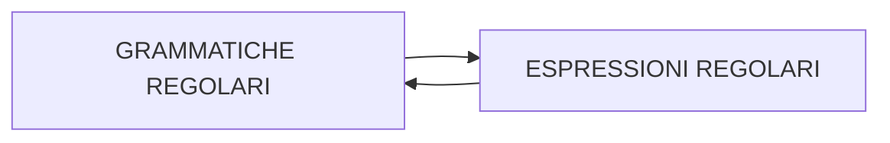

# Grammatiche regolari (tipo 3)

grammatiche le cui  produzioni ammettono un solo simbolo non terminale nel membro di destra.

| LINEARI A DESTRA             | LINEARI A SINISTRA          |
| ---------------------------- | --------------------------- |
| $$A \rightarrow \sigma  $$   | $$A \rightarrow \sigma  $$  |
| $$A \rightarrow \sigma B  $$ | $$A \rightarrow B\sigma  $$ |

 I linguaggi generati dalle grammatiche regolari coincidono con quelli descritti da [espressioni_regolari](linguaggi_modelli_computazionali/espressioni_regolari.md)

a ogni grammatica regolare corrisponde un automa in grado di riconoscerla

[PREVIOUS](linguaggi_modelli_computazionali/grammatiche_tipo_2.md) [NEXT](linguaggi_modelli_computazionali/espressioni_regolari.md)
