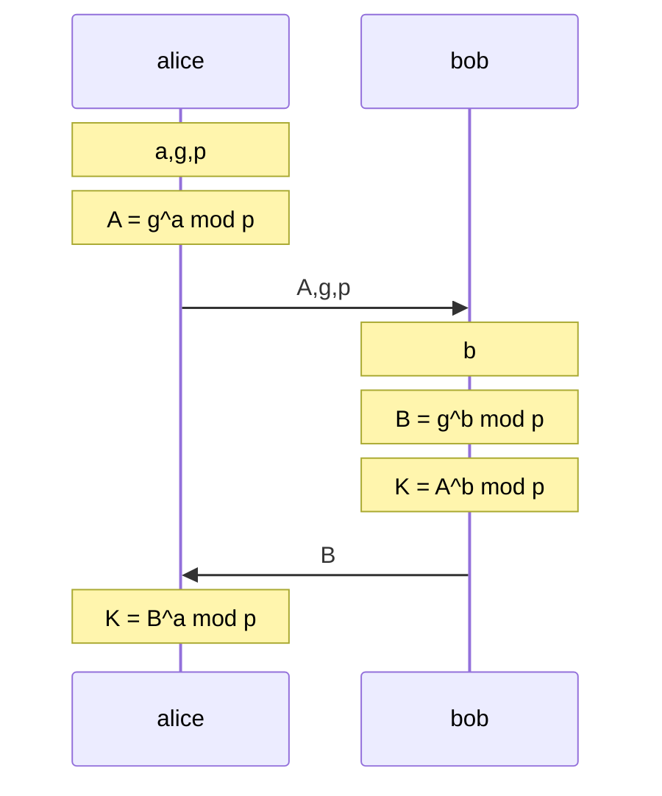

# Algoritmo diffie-hellman (versione anonima)

Non prevede alcun accordo precedente, attraverso un protocollo crittografico, ogni coppia di utenti è in grado tramite l’esecuzione del protocollo di concordare un segreto (*basato sul calcolo di logaritmi discreti*)

Le due parti arrivano a concordare la stessa chiave sfruttando le proprietà dell' esponenziazione modulare dato che

$$
K \space calcolata \space da \space B =
$$
$$
A^b\mod{p} =(g^a\mod{p})^b\mod{p} = 
$$
$$
(g^b\mod{p})^a \mod{p} = B^a\mod{p} = 
$$
$$
K \space calcolata \space da \space A
$$

Se l'attaccante ascoltasse la conversazione non sarebbe a conoscenza dei parametri $a,b$ necessari per risalire alla chiave di cifratura, con i parametri noti l'attaccante dovrebbe risolvere il problema noto della teoria dei numeri [calcolo del logaritmo discreto](problemi_difficili.md#calcolo%20del%20logaritmo%20discreto)

### Dh problematiche

L'algoritmo cosi presentato mostra problematiche legate all'autenticazione del richiedente, la destinazione sa che sta concordando una chiave con chi gli ha inviato i parametri $g,A,p$ ma non e in grado di dimostrarne l'autenticita

## Variante fixed

Nella variante fixed i parametri scambiati $A,g,p$ vengono certificati da una CA come nel caso delle chiavi pubbliche nei cifrari asimmetrici, tuttavia in questa modalità non e possibile cambiare i suddetti parametri senza rigenerare il certificato.

Con questa soluzione non e garantita l'identificazione delle parti, ma in caso di impersonificazione gli interlocutori non arrivano a concordare lo stesso segreto, tuttavia l'attaccante può indurre l'altra parte a generare dei cifrati

## Variante ephemeral

In questa variante viene utilizzata la firma digitale per mezzo di chiavi asimmetriche per garantire l' autenticità dei parametri scambiati, che vengono firmati con la suddetta chiave e inviati insieme al certificato della chiave pubblica, anche in questo caso non e possibile verificare l'identita dei mittenti ma **in caso di intrusione gli interlocutori non concordano lo stesso segreto**

[PREVIOUS](key_management.md) [NEXT](sicurezza_informazione/ipsec.md)