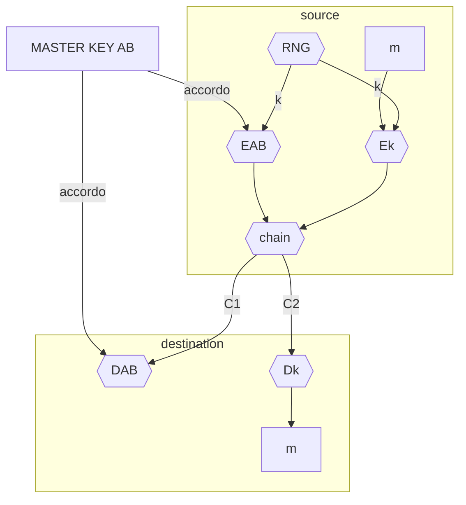
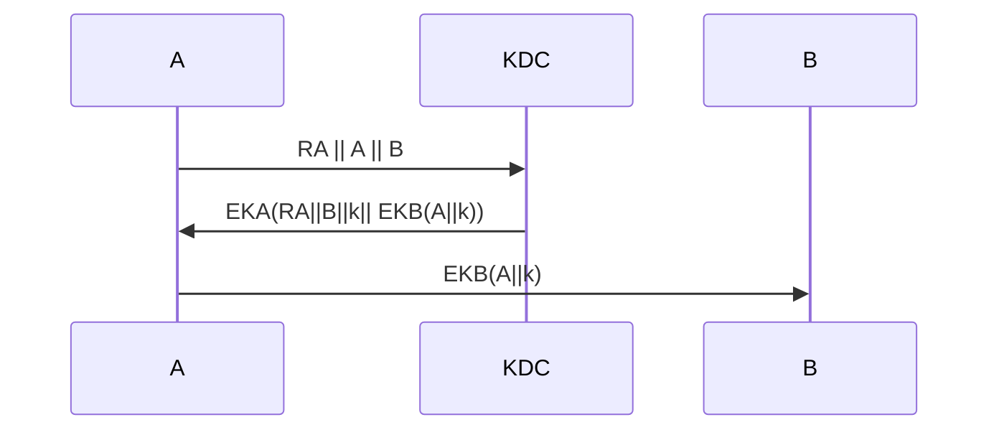
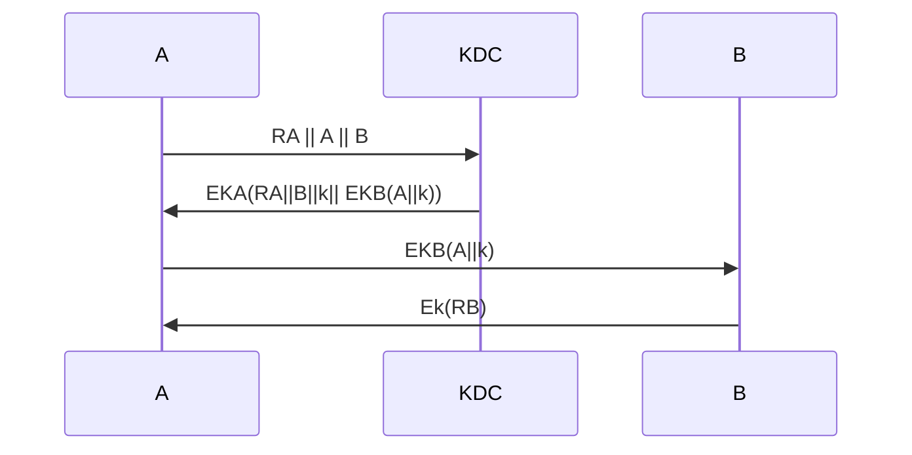

# Meccanismo di distribuzione delle chiavi

Nei [cifrari simmertrici](pages/sicurezza_informazione/cifrari_simmetrici.md#cifrari%20simmetrici) e fondamentale stabilire come distribuire la chiave agli interessati alla comunicazione, ci sono due modelli di interazione principali

- scambio su canale sicuro ([master key](#MASTER%20KEY), [key distribution center](#KEY%20DISTRIBUTION%20CENTER%20(KDC)))
- segreto concordato per mezzo di internet ([diffie_hellman](pages/sicurezza_informazione/diffie_hellman.md),[cifrari_asimmetrici](pages/sicurezza_informazione/cifrari_asimmetrici.md))

## Master key

Le due parti concordano una chiave su canale sicuro, per evitare di scambiare molti testi cifrati con la stessa chiave, la **master key non viene usata per cifrare i messaggi ma delle chiavi di sessione**, queste chiavi hanno durata limitata e vengono usate per cifrare i messaggi

La chiave di sessione viene generata dal mittente e inviata sul canale insicuro cifrata per mezzo della MASTER KEY, la destinazione la usa per decifrare i messaggi di una data sessione

### Master key e  scalabilità

Una sola master key condivisa non si presta bene a situazioni con alto numero di utenti dove il numero di chiavi da distribuire scala secondo $N^2$

## Key distribution center (kdc)

Soluzione che cerca di risolvere il problema di scalabilità della master key introducendo una terza entità il KEY DISTRIBUTION CENTER, i membri della rete concordano con il KDC una master key e quando un mittente vuole intraprendere una comunicazione chiede la master key del destinatario e fornisce al KDC la chiave di sessione.

In questo esempio A si identifica con KDC e mette B in grado di decifrare la comunicazione.

L'attaccante non può risalire a $K_a$ o $K_b$ pero può effettuare attacchi di replay con il 3 messaggio dato che $B$ non esegue una procedura di identificazione con $A$, questo può essere fatto per ottenere le seguenti informazioni:

- campioni di testo cifrato da analizzare
- intraprendere comunicazioni con B qual'ora l'attaccante sia risalito a k

2 possibili mitigazioni

- $B$ tiene traccia delle chiavi utilizzate (*molto costoso*)
- $B$ sfida il mittente del terzo pacchetto a identificarsi

### problematiche di un KDC

Le soluzioni con un KDC hanno delle problematiche intrinseche:

- il KDC **single point of failure**
- il KDC deve essere un elemento fidato per tutti i membri della rete

Per sopperire al problema del collo di bottiglia si può sfruttare il principio di località dove un KDC si occupa di una porzione ristretta della rete (*e.g. DNS*) e stabilire relazioni di fiducia tra i vari KDC

[<](pages/sicurezza_informazione/rsa.md)[>](pages/sicurezza_informazione/diffie_hellman.md)
