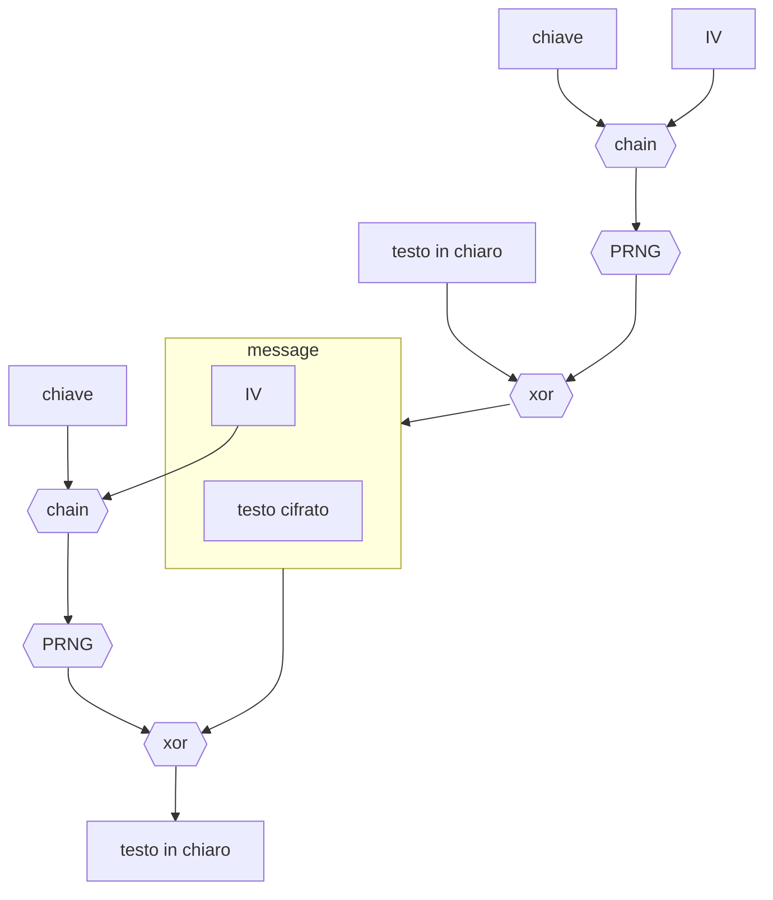

# Protocollo wep

Protocollo per la cifratura di testi per mezzo di [cifrari a flusso sincrono](pages/sicurezza_informazione/cifrari_simmetrici.md#cifrari%20a%20flusso)

Questo protocollo soffre del problema di [riutilizzo della chiave](pages/sicurezza_informazione/cifrari_simmetrici.md#riutilizzo%20delle%20chiavi) in quanto essa risulta essere la composizione di una parte statica e una dinamica che tuttavia si esaurisce in contesti di comunicazione molto pesanti (*e.g. molti byte da trasferire, comunicazioni wireless*)

Inoltre il cifrario utilizzato risulta **malleabile**, l'attaccante  e in grado di manipolare il testo cifrato in modo tale che in fase di decifrazione la destinazione ottenga un testo voluto dall'attaccante
[<](pages/sicurezza_informazione/cifrari_simmetrici.md)[>](pages/sicurezza_informazione/chiavi.md)
