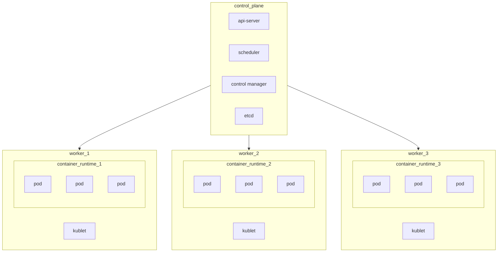

# Kubernetes

Kubernetes is a container orchestrator for managing high scale deployment challenges

## Architecture

The kubernetes cluster architecture presents itself as follows:

Where the **control plane** node manages the worker nodes that run pods, pods are managed trough a container runtime (*for example `containerd`*) that runs the contianers, the control plane is  also responsible for managing deployments

## Networking in a kubernetes cluster

Containers and pods share a private network stack  that allow them to communicate inside the cluster, and a name service
## Deployment in a kubernetes cluster

Deployment on a kubernetes cluster is done trough the use of the api server using a descriptor that specifies:

- containers
- images
- replicas
- volumes
- configurations

> [!NOTE] pods are the minimum unit of deployment in kubernetes